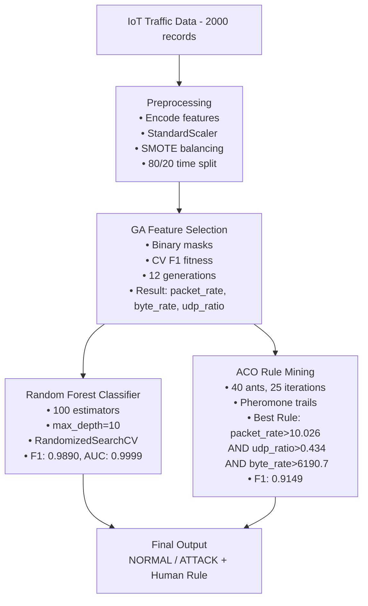

# IoT Anomaly Detection using ACO + Genetic Algorithm

Detects unusual/malicious traffic patterns in IoT networks using a 
bio-inspired hybrid approach combining Ant Colony Optimization (ACO), 
Genetic Algorithm (GA), and Random Forest classification.

---

## Dataset

Self-created synthetic IoT traffic dataset inspired by NSL-KDD and N-BaIoT.

| Property | Value |
|---|---|
| Rows | 2,000 |
| Columns | 8 |
| Benign | 92% |
| Attack | 8% |

**Features:** `timestamp`, `device`, `packet_rate`, `byte_rate`, 
`conn_count`, `tcp_syn`, `udp_ratio`, `label`

---

## Notebooks

| Notebook | Description |
|---|---|
| `01_EDA_Statistical_Analysis` | Data exploration & visualizations |
| `02_Anomaly_Detection_Model` | RF + GA + ACO pipeline |
| `03_Comparative_Analysis` | Model comparison across 4 algorithms |

---

## Methodology



**GA (Feature Selection)**
- Evolves binary feature masks to maximize cross-validated F1
- Population: 30 individuals, 12 generations
- Operators: tournament selection, two-point crossover, bit-flip mutation
- Selected features: `packet_rate`, `byte_rate`, `udp_ratio`

**ACO (Rule Mining)**
- Pheromone-guided search over feature-threshold nodes
- 40 ants, 25 iterations, evaporation rate = 0.1
- Best rule: `packet_rate > 10.026 AND udp_ratio > 0.434 AND byte_rate > 6190.7 → ATTACK`

**Pipeline**
- StandardScaler → SMOTE → Random Forest
- Time-based 80/20 train/test split
- Tuned via RandomizedSearchCV

---

## Results

| Model | Accuracy | F1-Score | ROC-AUC |
|---|---|---|---|
| Random Forest (selected) | 0.9975 | 0.9890 | 0.9999 |
| Logistic Regression (selected) | 0.9950 | 0.9778 | 0.9811 |
| Isolation Forest (selected) | 0.9925 | 0.9677 | 0.9995 |
| Local Outlier Factor | 0.8675 | 0.3291 | 0.6361 |
| ACO Rule (interpretable) | — | 0.9149 | — |

---

## Setup

```bash
git clone https://github.com/YOUR_USERNAME/IoT-Anomaly-Detection-ACO-GA.git
cd IoT-Anomaly-Detection-ACO-GA

pip install pandas numpy scikit-learn imbalanced-learn deap matplotlib seaborn joblib

jupyter notebook
```

Run notebooks in order: `01` → `02` → `03`

---

## Tech Stack

`Python 3.12` · `scikit-learn` · `DEAP` · `imbalanced-learn` · 
`Pandas` · `NumPy` · `Matplotlib` · `Seaborn`
